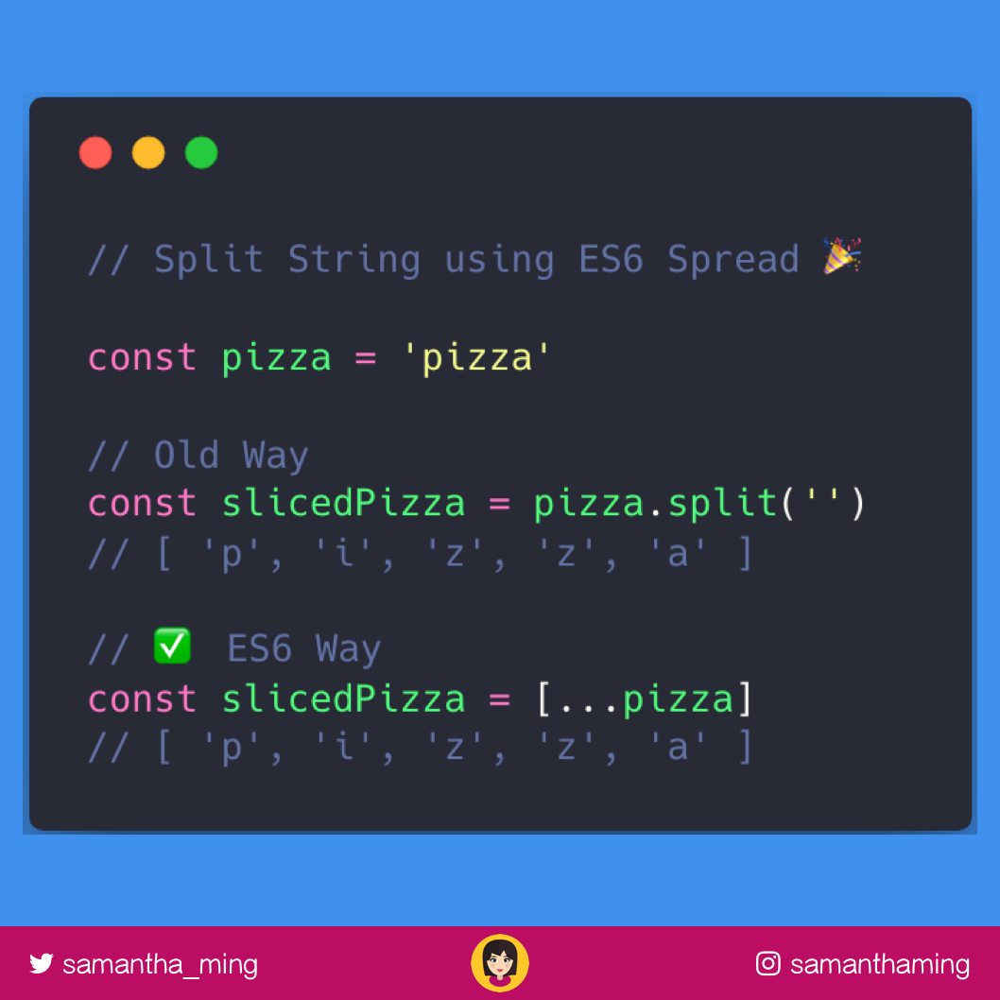

# Split String Using ES6 Spread

Split string using ES6 Spread 🎉

Convert a string to an array of characters using the spread syntax!

It goes through each character in the “pizza” string and assigns it to our new “splitPizza” array. Very cool 🤩


```javascript
const pizza = 'pizza';

// Old Way
const slicedPizza = pizza.split('');
console.log(slicedPizza) // [ 'p', 'i', 'z', 'z', 'a' ]

// ES6 Way
const slicedPizza2 = [...pizza];
console.log(slicedPizza2) // [ 'p', 'i', 'z', 'z', 'a' ]
```

## Like this Post

**[Like this on Twitter](https://twitter.com/samantha_ming/status/987758991026544640)**

**[Like this on Instagram](https://www.instagram.com/p/Bh1601FB4KJ/?taken-by=samanthaming)**


## Resources

- https://stackoverflow.com/questions/44900175/why-does-spread-syntax-convert-my-string-into-an-array?utm_medium=organic&utm_source=google_rich_qa&utm_campaign=google_rich_qa


## Image Download


