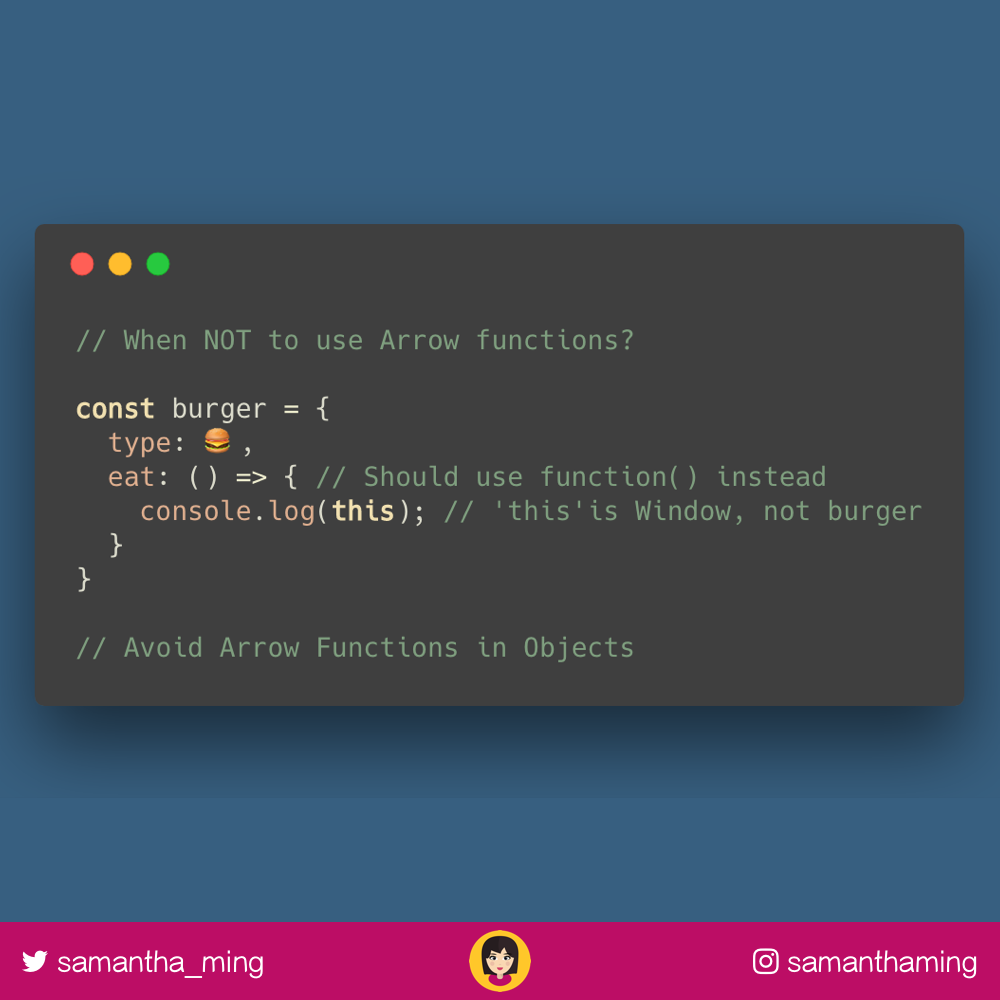

# When NOT to use Arrow Functions

Arrow functions are terrific, but not suitable for all situations. Avoid them in objects because 'this' is always scoped to the parent -- which is the 'window' in this case. 

```javascript

  type: '🍔',
  eat: () => { // Should use function() instead
    console.log(this); // 'this' is Window, not burger
  }
}

// Avoid Arrow Functions in Objects
```

## Like this Post

**[Twitter](https://twitter.com/samantha_ming/status/964977650375696384)**

**[Instagram](https://www.instagram.com/p/BfUHooqA1Wc/?taken-by=samanthaming)**


## Resources

- https://wesbos.com/arrow-function-no-no/


## Image Download


