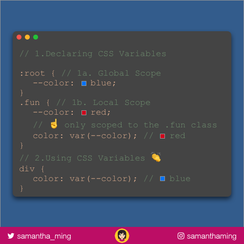

# Declaring CSS Variables

Move over Sass, we have CSS variables!

I still love Sass of course. But it’s great native CSS supports this.
✅ No need for preprocessors & No more compiling!


```css
:root { /* 1a. Global Scope */
  --color: blue;
}

.fun { /* 1b. Lobal Scope */
  --color: red;
  /* ☝️ only scoped to the .fun class */
  color: var(--color); /* red */
}

/* 2. Using CSS Variables */
div {
  color: var(--color); /* blue */
}
```

## Like this Post

**[Twitter](https://twitter.com/samantha_ming/status/967484515835822081)**

**[Instagram](https://www.instagram.com/p/Bflz5FeAHUu/?taken-by=samanthaming)**


## Resources

- https://medium.freecodecamp.org/everything-you-need-to-know-about-css-variables-c74d922ea855


## Image Download


