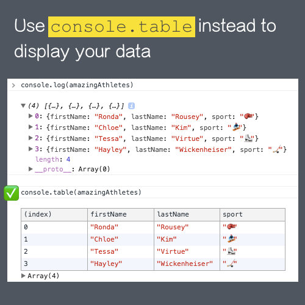

# Use `console.table` to display your data

This is a cool way to display your data in your browser dev tools. Works great with Array and Objects. Instead of console.log, try `console.table` next time ⭐️ 

## Like this Post ❤️

**[Like this on Twitter](https://twitter.com/samantha_ming/status/964174008219418625)**

**[Like this on Instagram](https://www.instagram.com/p/BfOVuAggSI1/)**

## Image Download

