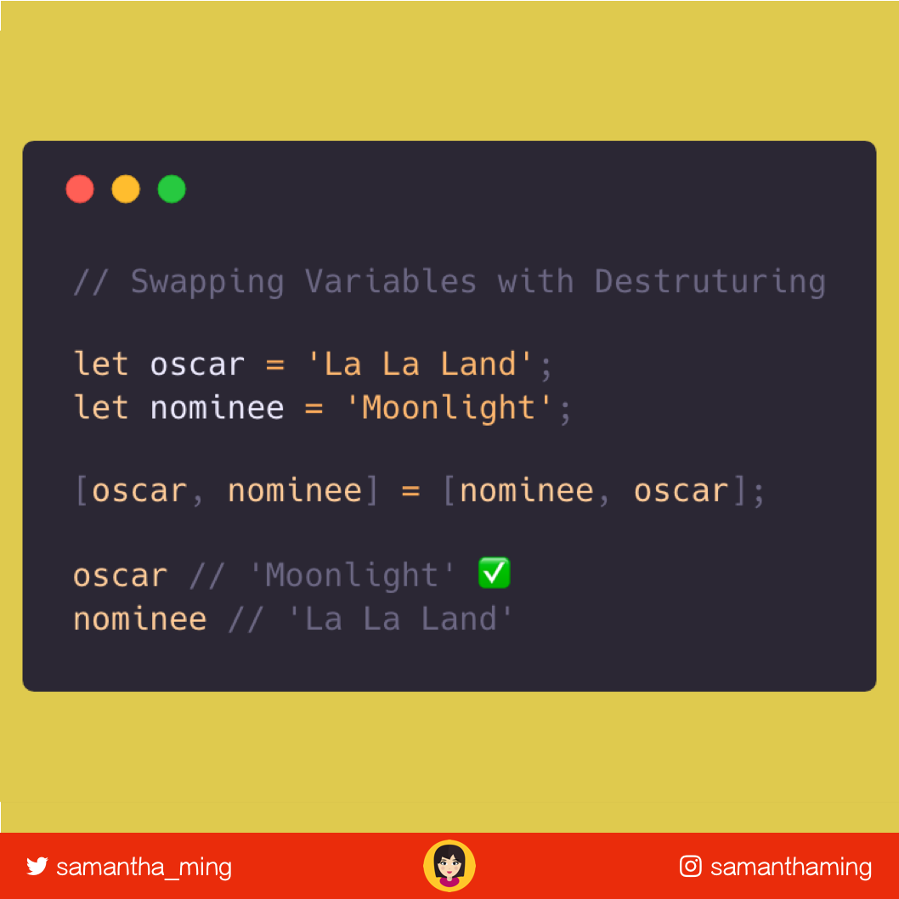

# Swapping Variables With Destructuring

ES6 Destructuring to the rescue 🏆

Easily swap two variables using ES6 destructing. It’s a great way to fix #Oscars Best Picture mix-ups 😜


```javascript
let oscar = 'La La Land';
let nominee = 'Moonlight';

[oscar, nominee] = [nominee, oscar];

console.log(oscar) // Moonlight
console.log(nominee) // La La Land
```

## Like ❤️

**[Like this on Twitter](https://twitter.com/samantha_ming/status/977621585359089664)**

**[Like this on Instagram](https://www.instagram.com/p/Bgt5uzwAg8_/?taken-by=samanthaming)**


## Image Download


